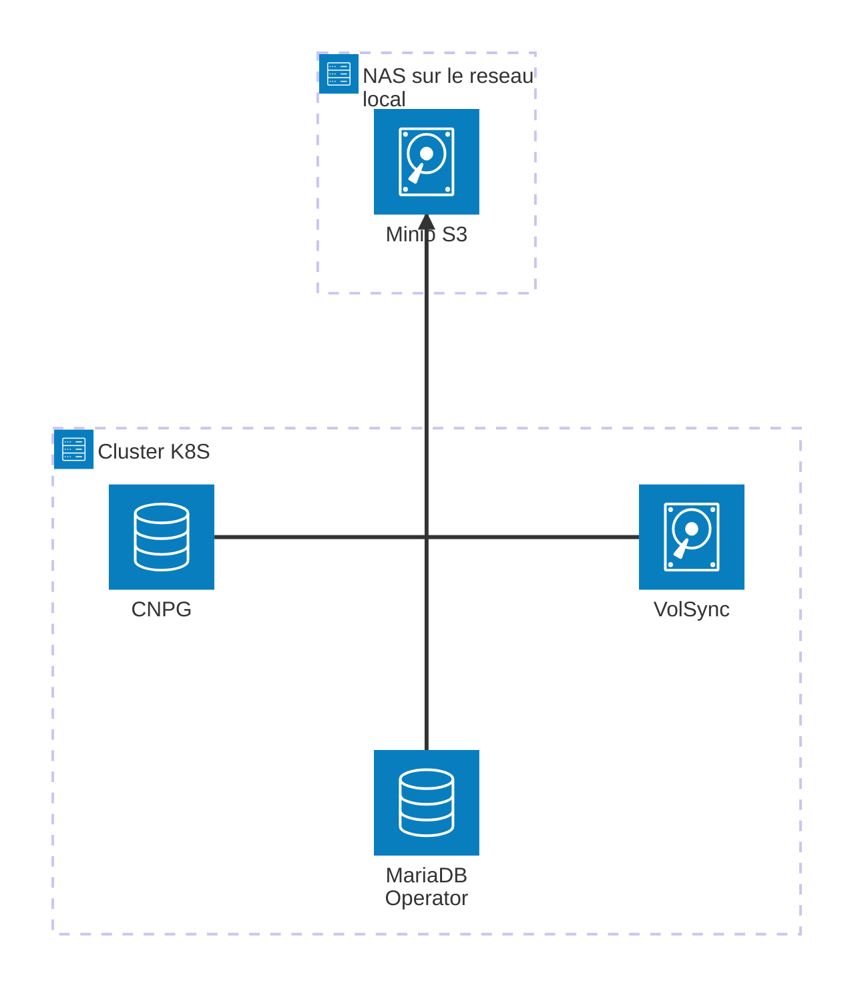

Bonne année à tous ! 🎉

Pour ce premier article de 2025, nous allons parler DevOps, ou plus particulièrement Kubernetes. Cela sera l'occasion d'aborder des notions d'infrastructures,
de déploiements continue, de gestion de secrets, etc.

<!--more-->

> [!WARNING]
>
> Avant d'aller plus loin, il est important de noter que je ne suis absolument pas un expert et il est fort probable que certaines de mes manières de faire ne
> soient abssoluments pas optimales ou recommendés. N'hésitez pas à me faire part de vos retours pour m'aider à m'améliorer.

## Introduction

Cela fait maintenant plusieurs années que je possède un home-server et il n'a cessé d'évoluer sur le plan technique ou sur celui de la puissance de calcul. Au
début, il y a environs 9 ans, j'ai commencé avec un simple Raspberry Pi 2 sur lequel était installé Docker Swarm. Au fil tu temps, j'ai migré vers deux
Raspberry Pi 3 d'abord avec Docker Swarm puis avec Kubernetes, puis ajouté un Raspberry Pi 4. Ensuite, il y a environ 2 ans, j'ai remplacé ces Raspberry Pi par
deux Oranges Pi 5 équipés de disques NVME. Enfin, l'année dernière, j'ai intégré un PC neuf à mon cluster Kubernetes. Et cette année, j'ai finalement décidé de
débrancher mes Oranges Pi pour ne converver que le PC.

## Le serveur

### Le matériel

Le serveur est un PC monté moi-même pour l'occasion. Il possède les caractéristiques suivantes :

- Processeur : AMD Ryzen 5 5800G
- RAM : 32 Go (2x 16Go DDR5 5200MHz CL40)
- Carte mère: ASRock B650M-H/M.2+
- Alimentation: Cooler Master MWE Gold 550 FM (v2)
- Stockage: 1x SSD NVMe 512 Go
- Boitier: Fractal Design Core 1100

(Et oui, je me suis fais plaisir au moment de l'achat ! 😝)

### Le système d'exploitation

Pour le choix du système d'exploitation, j'ai opté pour un choix plutôt exotique à première vue, mais assez intéressant : [NixOS](https://nixos.org/). NixOS est
une distribution Linux basée sur Nix, un gestionnaire de paquets fonctionnel. Cela implique que la configuration du système est déclarative et que les paquets
sont isolés les uns des autres. En plus de me simplifier l'installation et paquets de bases, NixOS me permet aussi de rapidement configurer kubernetes (k3s) et
d'autres services avec assez peu de configuration. Cumulé à cela, j'ai activé la fonctionnalité de [Flake](https://wiki.nixos.org/wiki/Flakes) qui m'ouvre la
voie à encore plus de capacité à la configuration.

### Le déploiement du système

Avant d'utiliser NixOS, toutes mes infrastructures utilisaient toujours une distribution basé sur Debian (Debian et Armbian plus précisément) et toute
l'installation des outils se faisaient par le biais de scripts Ansible.

Ansible et Nix Flake sont deux outils ayant un objectif similaire : permettre un déploiement automatisé et reproductible. Il faut tout de même noter que leur
procédé de fonctionnement est assez différent. Ansible est un outils de déploiement avec une configuration dite "impérative", c'est à dire que l'on décrit les
étapes à suivre pour arriver à un état donné. Nix Flake, quant à lui, est un outil de déploiement avec une configuration dite "déclarative", c'est à dire que
l'on décrit l'état final que l'on souhaite obtenir à la fin.

Cette différence de paradigme est assez importante et c'est ce qui m'a poussé à essayer NixOS. En effet, il faut savoir que jusqu'à présent, je faisais tous mes
déploiements via Ansible, mais au fur et à mesure du temps, le coût de maintenance des scripts devenait de plus en plus important en raison des mises à jours
des nombreuses dépendences nécessaires (k3s, networking, adressage des IPs, etc.). Avec Nix Flake, j'ai n'ai plus trop à me soucier de cela, et mieux encore,
des morceaux de mes configurations sont plus facilement réutilisables. (C'était déjà un peu le cas avec Ansible, mais pas autant).

> [!TIP]
>
> Pour ceux qui souhaitent en savoir plus sur NixOS, je vous recommande de lire le [manuel officiel](https://nixos.org/manual/nixos/stable/).

Voici un petit exemple de configuration Nix pour installer et configurer K3S :

```nix
## Il faut imaginer que ce fichier est importé ailleur dans la configuration, ce qui permet de
## fournir le champ `pkgs` et les autres variables.
{
  pkgs,
  kubeconfigFile,
  tokenFile,
  # Initialize HA cluster using an embedded etcd datastore.
  # If you are configuring an HA cluster with an embedded etcd,
  # the 1st server must have `clusterInit = true`
  # and other servers must connect to it using `serverAddr`.
  #
  # this can be a domain name or an IP address(such as kube-vip's virtual IP)
  masterHost,
  clusterInit ? false,
  kubeletExtraArgs ? [],
  nodeLabels ? [],
  nodeTaints ? [],
  disableFlannel ? true,
  nodeIps,
  ...
}: let
  lib = pkgs.lib;
in {
  # Installation de paquet systèmes
  environment.systemPackages = with pkgs; [
    k9s # k9s est un outil TUI pour kubernetes
    kubectl # CLI officiel pour kubernetes
    kubecolor # coloration syntaxique pour kubectl (facultatif)
    istioctl # outil de ligne de commande pour Istio
    kubernetes-helm # outil de gestion de paquets pour kubernetes
    clusterctl # CLI pour piloter kubernetes depuis son api
  ];

  # Configuration du pare-feu
  networking.firewall = {
    allowedTCPPorts = [
      6443 # k3s: required so that pods can reach the API server (running on port 6443 by default)
    ];
    allowedUDPPorts = [
      8472 # k3s, flannel: required if using multi-node for inter-node networking
    ];
  };

  # Configuration de k3s
  services.k3s = {
    enable = true;
    # On hérite des variables définies plus haut
    inherit package tokenFile clusterInit;
    serverAddr =
      if clusterInit
      then ""
      else "https://${masterHost}:6443";

    # On spécifie le role du noeud
    role = "server";

    # On spécifie les flags à passer à k3s
    # https://docs.k3s.io/cli/server
    extraFlags = let
      flagList =
        [
          "--write-kubeconfig=${kubeconfigFile}"
          "--write-kubeconfig-mode=644"
          "--kube-apiserver-arg='--allow-privileged=true'" # required by kubevirt
          "--data-dir /var/lib/rancher/k3s"
          "--etcd-expose-metrics=true"
          # to enable dual-stack, these flags are required
          # https://docs.k3s.io/networking/basic-network-options#dual-stack-ipv4--ipv6-networking
          "--cluster-cidr=10.42.0.0/16,2001:cafe:42::/56"
          "--service-cidr=10.43.0.0/16,2001:cafe:43::/112"
          # disable some features we don't need
          "--disable-helm-controller" # we use fluxcd instead
          "--disable=traefik" # deploy our own ingress controller instead
          "--disable=servicelb" # we use metallb instead
          "--tls-san=${masterHost}"
          "--node-ip=${lib.concatStringsSep "," nodeIps}"
        ]
        ++ (map (label: "--node-label=${label}") nodeLabels)
        ++ (map (taint: "--node-taint=${taint}") nodeTaints)
        ++ (map (arg: "--kubelet-arg=${arg}") kubeletExtraArgs)
        ++ (lib.optionals disableFlannel ["--flannel-backend=none"])
        ++ (lib.optionals (!disableFlannel) ["--flannel-ipv6-masq=true"]);
    in
      lib.concatStringsSep " " flagList;
  };
}
```

Comme vous pouvez le constater, la configuration est assez lisible dans l'ensemble. Le language Nix permet d'effecter des opérations assez complexes et ce
script en est un exemple. En une cinquantaine de lignes, nous avons une configuration complète pour installer et configurer k3s, configurer le pare-feu, et
installer quelques outils supplémentaires.

Si nous devions refaire la même chose avec Ansible, cela nous prendrait beaucoup plus de lignes (pas tant que ça, mais tout de même) et surtout, cela nous
demanderait de réfléchir en amont à l'ordre d'exécution des tâches à effectuer, à la gestion des erreurs, etc.

> [!CAUTION]
>
> Attention tout de même, NixOS n'est pas une solution miracle et il est possible de se retrouver dans des situations assez complexes si l'on ne fait pas
> attention. Il est donc important de bien comprendre les concepts de base avant de se lancer.
>
> Un autre point à noter, c'est que NixOS, en plus de ne pas réspecter les standards POSIX sur la structure du système de fichier (impliquant la mise en place
> de nombreux bricolages pour faire fonctionner certains programmes), demande une quantité de stockage plus importante que des distributions plus classiques.

## Pourquoi Kubernetes ?

Kubernetes est un orchestrateur de conteneurs open-source qui permet d'automatiser le déploiement, la mise à l'échelle et la gestion des applications
conteneurisées. Il est conçu pour gérer des applications conteneurisées sur un cluster de machines. Il a été conçu à l'origine par Google et est maintenant
maintenu par la Cloud Native Computing Foundation.

Dans mon cas, Kubernetes me permet de déployer et de faire la maintenance rapidement et facilement des applications sur mon serveur. Dans le cas où je déploie
un grand nomrmes de services, avoir Kubernetes me simplifie grandement la gestion de tout cela.

Néanmoins ! Qui dit simplicité au déploiement, dit complexité à la configuration de l'infrastructure. En effet, Kubernetes est un outil très puissant mais qui
peut être difficile à appréhender. Il est donc important de bien comprendre les concepts de base avant de se lancer.

## Processus de déploiement

Jusque là, j'ai surtout parlé de NixOS et de Kubernetes sans être exactement rentré dans les détails de _pourquoi_ c'est effectivement plus simple à utiliser.
C'est ce que nous allons voir maintenant.

### Continuous Integration

Afin d'éviter de déployer des configurations cassées, j'ai mis en place des outils tel que des Github Actions et des hook `pre-commit` pour vérifier la syntaxe
des fichiers et les formater.

De cette manière, je m'assure que les fichiers que je vais commiter sont corrects et que je n'aurais pas de surprise lors du déploiement. (Cela ne garantit pas
que le déploiement sera sans erreur, mais cela réduit les risques).

Pour cela, j'utilise 2 outils : `pre-commit-hooks` qui me fait toutes les vérifications avant le commit et `github actions` qui me fait les vérifications lors
du push sur la branche `main`. En complément, j'utilise [Renovate Bot](https://docs.renovatebot.com/) qui a pour rôle de vérifier les mises à jours des
dépendances de mes projets. Tous les lundis, Renovate Bot va aller scanner le projet et chercher si des mises à jours sont disponibles. Si c'est le cas, il va
ouvrir une PR pour me proposer d'appliquer ces mises à jours.

### Continuous Deployment

Une fois un commit poussé sur Github, l'outil [FluxCD](https://fluxcd.io/) (installé dans le cluster Kubernetes) va aller chercher les derniers commits
disponibles. Son rôle est de synchroniser les configurations présentent dans le dépôt avec ce qui est actuellement déploiment en production. À partir de là, il
va essayer de faire de son mieux pour appliquer les changements jusqu'à atteindre l'état attendu. Voici un exemple de configuration que FluxCD est capable
d'interpréter pour faire la synchronisation:

```yaml
---
## On utilise une ressource custom fournit par FluxCD
apiVersion: kustomize.toolkit.fluxcd.io/v1
kind: Kustomization
metadata:
  name: website
  namespace: flux-system
spec:
  # On veut que cette configuration soit synchronisé toutes les 30 minutes
  interval: 30m
  # Les valeurs `path` et `sourceRef` disent à FluxCD d'aller chercher les configuration dans le
  # dépôt Git logées au chemin spécifié. Dans mon cas, cela correspond au dépôt actuel dans le
  # dossier `./app` par rapport ce fichier de configuration
  path: ./k3s/fluxcd/apps/base/website/app
  sourceRef:
    kind: GitRepository
    name: flux-system
    namespace: flux-system
  # Si besoin, on détruit les ressources qui ne servent plus
  prune: true
  # On s'attend ce que le déploiment soit fait sous 10 minutes
  timeout: 10m
  # On informe FluxCD qu'il peut statuer le déploiement comme "prêt" uniquement lorsque le statut
  # de l'objet spécifié est lui aussi statué comme "prêt".
  healthChecks:
    - kind: Deployment
      name: website
      namespace: website
```

Toutefois, il peut arriver qu'il ne soit pas capable re-synchroniser en raison d'erreur pouvant être présente à plusieurs niveaux (erreur de configuration,
image non-disponible, etc.). Quand cela arrive, FluxCD est capable de m'envoyer une notification directement sur Discord par le biais d'un webhook. Ce qui me
permet alors d'intervenir pour régler le problème.

### Sauvegarde des données

Ma précédente installation (2024) était équipé du système de sauvegarde de Longhorn. Sur le papier, le procédé fonctionnait bien, les volumes étaient bien copié
sur mon NAS via NFS. Mais quand l'infrastructure à lâché, j'ai tout de même perdu quelques données en chemin (par exemple, des données de base de donnée
Postgres qui n'ont pas supporté le processus). Heureusement pour moi, je n'ai perdu que très peu de donnée, mais cela m'a tout de même fait réfléchir à mon plan
de sauvegarde de mes données.

J'en suis donc arrivé à la conclusion de totalement abandonner le système de Longhorn et de les gérer indépendament. J'ai donc révisé ma procédure comme suis :

- Toutes mes sauvegarde passent maintenant par un serveur Minio S3 installé sur le NAS.
- Les sauvegarde de base de données postgres (Cloud Native PG) sont maintenant géré directement par CNPG lui même avec
  [son système automatisé](https://cloudnative-pg.io/documentation/current/backup/). De cette manière, je suis assuré que les sauvegardes seront compatible sans
  défaillance lié au processus de sauvegarde.
- Un de mes service nécessite une base de donnée MariaDB. Avant je ne déployais qu'un simple pod et je sauvegardais le volume, mais là j'ai décidé d'aller plus
  loin en installant MariaDB Operator. Ce dernier, à la manière de CNPG, s'occupe lui aussi de sauvegarder les base de données sur S3.
- Pour finir, tous les autres volumes sont sauvegarder grâce à [VolSync](https://volsync.readthedocs.io/), un outil spécialisé dans les plan de sauvegarde de
  volumes Kubernetes. Et vous savez quoi ? Il est aussi compatible S3 ! (sans grande surprise 😄)

Toutes les sauvegardes sont exécutés de manière hebdomadaires avec une rétention de 4 semaines avant suppression. Ce qui me laisse une marge plutôt confortable
en cas de panne du système.



### Et les secrets dans tout ça ?

La gestion des secrets est le dernier point que nous allons aborder aujourd'hui. Bien que mon dépôt soit privé, je ne peux pas non plus me permettre de laisser
des données aussi sensible (clé api, mot de passe, etc.) accessible tel quel dans les fichiers. Pour remédier à ce problème, je passe par l'outil
[SOPS](https://github.com/getsops/sops). Son fonctionnement est assez sommaire : il nécessite une clé GPG/SSH publique en entrée pour chiffrer les données, et
la clé GPG/SSH privée associé pour déchifrer. À partir de là, on peut rajouter plusieurs clés correspondant à plusieurs machine et il se débrouillera pour
chiffrer les données pour toutes les clés.

Le programme est très bien intégré dans FluxCD et dans Nix (via [sops-nix](https://github.com/Mic92/sops-nix/)), ce qui en fait un outil idéal pour gérer mes
données sensibles.

Par précaution, j'ai quand même un outil ([GitGuardian](https://www.gitguardian.com/)) dans ma CI Github pour scanner mes fichiers à la recherche de potentiel
secret oublié. Évidément, si votre infrastructure est très sensible (dans le contexte en entreprise par exemple), il serait toujours possible d'installer ces
outils en interne _on-premise_.

## Conclusion

Cette petite aventure a été à la fois instructive et amusante. J'ai pu tirer parti de la panne complète de mon ancienne installation pour repartir de zéro et
réorganiser toutes mes configurations. De plus, j'ai pu combler mes lacunes et tester de nouveaux outils tels que SOPS, FluxCD, NixOS et VolSync.

Après un peu plus d'un mois de fonctionnement, je n'ai toujours pas rencontré de problème "majeur". On peut donc supposer que c'est migration est dans
l'ensemble un succès. 😎

Si vous souhaitez avoir plus d'informations sur certains point, n'hésitez pas à me contacter par le biais des
[Github Discussions](https://github.com/Bricklou/website/discussions). J'essaierais de vous répondre et de mettre à jours ce post avec les informations
complémentaires.
