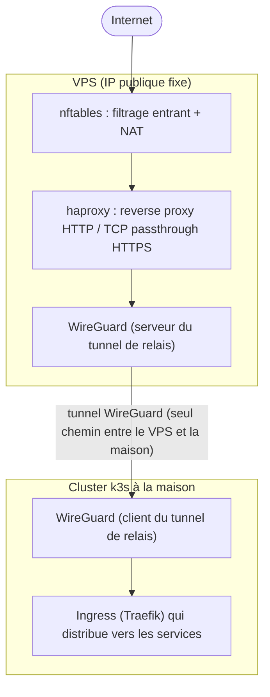

Dans post de début d'année sur la [configuration de mon serveur Kubernetes](), j'ai pu parler de
la manière dont j'ai mis en place mon infrastructure. Néanmoins, j'ai omis un détail quelque peu important : la gestion réseau et l'accès depuis l'extérieur.

<!--more-->

# Introduction

Dès que l'on souhaite héberger ses propres services depuis son domicile, nous arrivons inévitablement à ce moment crucial où il faut ouvrir les ports de notre
routeur pour permettre l'accès externe au serveur. J'ai moi-même utilisé cette approche pendant plusieurs années, en gérant les difficultés liées au changement
d'adresse IP imposé par mon fournisseur d'accès internet.

Et si je vous disais qu'il existe une alternative ? Dans cet article, nous explorerons une approche différente qui permet l'accès externe tout en renforçant la
sécurité (par la fermeture complète du réseau local) et en éliminant la dépendance à l'adresse IP domestique.

> **Note :** Cet article s'inspire grandement d'une publication sur le blog [folf.fr](https://blog.folf.fr/wireguard/), que j'ai ensuite amélioré, adapté et
> étendu pour répondre à mes besoins spécifiques. Bien que l'approche de base reste similaire, j'ai ajouté mes propres optimisations, notamment l'intégration
> avec NixOS, la gestion avancée des règles de pare-feu avec nftables (au lieu d'IP table), et des considérations pratiques issues de mon expérience
> personnelle. Je vous invite à aussi lire son travail pour lui donner un peu plus de visibilité.

# L'ancienne approche : le port forwarding

Pendant longtemps, l'accès à mes services depuis l'extérieur reposait sur une méthode classique : quelques règles de redirection de port sur ma box internet,
pointant directement vers mon cluster k3s à la maison. Ça fonctionne, c'est simple à mettre en place, mais ça a plusieurs inconvénients qui ont fini par me
déranger : mon adresse IP publique est exposée directement, avec tout ce que ça implique en scans, tentatives de connexion et autres joyeusetés qui trainent
sur internet. Mon réseau local devient une cible directe dès qu'un service exposé a une faille, puisque le port ouvert donne un accès direct à ma maison, pas
à une simple façade. Mon adresse IP change en plus régulièrement, mon fournisseur d'accès ne me fournissant pas d'IP fixe, ce qui m'oblige à jongler avec du
DNS dynamique. Et enfin, toute la configuration réseau dépend de ma box, un équipement que je ne maitrise pas totalement et sur lequel je n'ai qu'un contrôle
limité.

# La nouvelle approche : un VPS en façade

L'idée est simple : au lieu d'exposer directement ma maison sur internet, je loue un petit VPS chez OVH avec une IP publique fixe, et c'est lui qui devient le
point d'entrée. Le trafic qui arrive dessus est ensuite relayé vers mon cluster à la maison via un tunnel WireGuard, et plus aucun port n'a besoin d'être ouvert
sur ma box.



Ce que ça change concrètement : ma box n'a plus aucune règle de redirection de port, la seule chose que fait mon serveur à la maison étant d'établir une
connexion sortante vers le VPS pour monter le tunnel WireGuard - un routeur grand public gère ça nativement, sans aucune configuration côté box. Si le VPS se
fait compromettre ou scanner dans tous les sens, c'est par ailleurs une machine jetable, réinstallable en quelques minutes, qui n'a accès qu'au strict
nécessaire de mon réseau local via le tunnel. L'IP publique associée à mon domaine est désormais fixe, plus besoin de DNS dynamique. Et en bonus, ce VPS va
aussi pouvoir me servir à héberger d'autres services, donc ce n'est pas une ressource dormante.

# Le tunnel WireGuard

Il y a en réalité **deux tunnels WireGuard distincts** chez moi, et il vaut mieux bien les différencier. D'un côté, un tunnel **VPN personnel**, pour accéder à
mon réseau local depuis mon téléphone ou mon laptop en déplacement, qui existait déjà avant la migration vers le VPS. De l'autre, un tunnel de **relais**,
celui qui nous intéresse ici, qui relie le VPS à la maison et qui sert uniquement à faire transiter le trafic entrant vers le cluster.

Côté VPS, la configuration du tunnel de relais ressemble à ça :

```ini
[Interface]
PrivateKey = <clé privée du VPS>
Address = 10.66.66.1/24, fd42:42:42::1/64        # adresse du VPS dans le tunnel
ListenPort = 51821                               # port UDP sur lequel le VPS attend la maison

[Peer]
PublicKey = <clé publique de la maison>
AllowedIPs = 10.66.66.2/32, fd42:42:42::2/128    # seule IP autorisée à traverser ce peer : la maison
```

Et côté maison (déclaré en NixOS) :

```nix
networking.wireguard.interfaces.wg_vps = {
  ips = [ "10.66.66.2/32" "fd42:42:42::2/128" ];       # adresse de la maison dans le tunnel
  peers = [{
    publicKey = "<clé publique du VPS>";
    endpoint = "<IP publique du VPS>:51821";           # où joindre le VPS
    allowedIPs = [ "10.66.66.1/32" "fd42:42:42::1/128" ]; # seule IP autorisée à traverser ce peer : le VPS
    persistentKeepalive = 25;                          # garde le tunnel ouvert malgré le NAT de la box
  }];
};
```

> [!TIP]
>
> Une erreur classique (que j'ai moi-même faite) est de penser que `AllowedIPs` fonctionne comme une liste de contrôle d'accès, c'est-à-dire "quelles IPs ont le
> droit de passer". En réalité, ce champ définit une **table de routage** : il indique quelles IPs doivent être routées à travers ce peer. Une mauvaise
> compréhension de ce champ m'a valu un bon après-midi de dépannage à me demander pourquoi mon serveur n'avait plus accès à internet du tout. 😅

# Le pare-feu côté VPS

Le VPS ne doit laisser passer que le strict nécessaire. Sa configuration nftables ressemble grossièrement à ceci :

```text
# Entrant : uniquement SSH (sur un port non standard), HTTP/HTTPS et les ports WireGuard
iifname "ens3" tcp dport 2222 accept
iifname "ens3" tcp dport { 80, 443 } accept
iifname "ens3" udp dport { 51820, 51821 } accept

# Forward : uniquement ce qui doit transiter vers le tunnel
iifname "ens3" oifname "wg0" ct state new tcp dport { 22 } accept
iifname "ens3" oifname "wg0" ct state new udp dport { 51820 } accept

# NAT : redirection vers la maison via le tunnel
iifname "ens3" tcp dport 22 dnat ip to 10.66.66.2:22
iifname "ens3" udp dport 51820 dnat ip to 10.66.66.2:51820
```

Deux petits détails qui valent le coup d'être mentionnés. Le port **22** est redirigé dans le tunnel pour matcher le SSH de mon serveur à la maison, tandis que
le SSH du VPS lui-même écoute sur **2222** — pas vraiment un choix de sécurité réfléchi, plutôt de la configuration par pure flemme pour ne pas avoir à gérer
un conflit de port entre les deux machines. Et les ports 80 et 443 ne sont **pas** redirigés directement au niveau du NAT : j'ai une configuration HAProxy qui
s'en charge, un cran plus haut.

# Le reverse proxy HTTP(S)

Devant le cluster, j'ai mis en place un HAProxy fait le tri entre HTTP et HTTPS :

```text
frontend http-in
    bind *:80
    mode http
    default_backend k3s-http

backend k3s-http
    server k3s 10.66.66.2:80

frontend https-in
    bind *:443
    mode tcp
    default_backend k3s-https

backend k3s-https
    server k3s 10.66.66.2:443 send-proxy-v2
```

Le port 80 est traité en reverse proxy HTTP classique. Le port 443, en revanche, est traité en **TCP passthrough** : haproxy ne déchiffre rien, il se contente
de faire suivre les octets tels quels jusqu'à l'ingress à la maison, qui garde la responsabilité de terminer le TLS. L'option `send-proxy-v2` permet de
transmettre l'adresse IP réelle du client via le protocole PROXY, pour que l'ingress ne voie pas systématiquement l'IP du VPS comme unique origine du trafic.

HAProxy me sert aussi de garde-fou en cas de souci avec mon serveur à la maison : des pages d'erreur personnalisées sont configurées pour chaque code
(400, 403, 408, 500, 502, 503, 504), avec un `deny_status 503` explicite sur les deux frontends. Si le tunnel tombe ou que le serveur à la maison ne répond
plus, le visiteur tombe sur une page d'erreur *propre* (dans la limite des pages par défaut de HAProxy) plutôt que sur une connexion qui traine ou se coupe brutalement.

# Côté cluster : Cilium et les interfaces réseau

Petite parenthèse qui n'a rien à voir avec le sujet principal de cet article, mais qui a un impact direct sur la configuration du tunnel : depuis mon dernier
post, j'ai migré le CNI de mon cluster de flannel vers [Cilium](https://cilium.io/). Cette migration est majoritairement motivée par des défauts et bugs d'implémentation au niveau
de l'IPv6 dans flannel, notamment sur la gestion des redirections.

Cette migration a eu un impact sur la configuration du tunnel : il a fallu explicitement indiquer à Cilium quelles interfaces réseau doivent être prises en
compte pour le routage des IP virtuelles de mes `LoadBalancer` :

```nix
devices = [ "enp7s0" "wg_vps" "wg0" ];
```

Sans ça, le trafic entrant par le tunnel WireGuard n'était tout simplement pas pris en charge par le datapath eBPF de Cilium : les connexions arrivaient bien
jusqu'à l'interface, mais repartaient en `RST` immédiatement. Un bon moment de capture de paquets avec `tcpdump` a été nécessaire pour comprendre que Cilium
ignorait purement et simplement les paquets provenant d'une interface qu'il ne surveillait pas.

# État actuel et reproductibilité

Contrairement au reste de mon infrastructure qui est gérée en NixOS et déployée via Flux, le VPS tourne sous **Debian**, une machine "classique" que je ne
voulais pas intégrer à mes Flakes Nix. Pour assurer sa reproductibilité, j'ai introduit un provisioning entier via un playbook **Ansible**, qui installe et
configure Docker, nftables, haproxy, un runner Forgejo Actions, un cache de registre Docker et WireGuard (utilisé par mon serveur) - de quoi reconstruire la
machine de zéro en quelques minutes si besoin.

J'ai également ajouté quelques scripts pour simplifier l'ajout de nouveaux pairs WireGuard (typiquement pour un nouveau téléphone ou ordinateur), avec génération automatique
d'un QR code à scanner.

# Limites connues

Cette configuration n'est pas exempte de dette technique. Notamment, le script de démarrage du tunnel WireGuard sur le VPS crée sa propre règle de masquerade
via `ip nat`, en plus de celle déjà définie dans la configuration nftables — deux tables différentes qui cohabitent sans se marcher dessus pour l'instant, mais
que je devrais unifier un jour, dans la mesure où ça touche à la seule route d'entrée vers mon réseau local.

# Conclusion

Cette migration du port forwarding vers une VPS en façade a réglé la plupart des problèmes qui me dérangeaient dans mon ancienne configuration : plus de ports
ouverts sur ma box, une IP publique fixe et jetable, et un réseau local qui reste fermé même en cas de compromission de la façade. Le tunnel WireGuard, une fois
la subtilité des `AllowedIPs` bien comprise, est étonnamment simple à maintenir, et Ansible + NixOS me permettent de reconstruire l'ensemble de la chaîne sans
douleur en cas de pépin.

Un autre avantage à mentionner : si un jour je dois déménager, je n'aurai rien à reconfigurer sur mon serveur. Dès qu'il aura de nouveau accès à internet,
l'ensemble de mes services sera à nouveau disponible. La classe, non ? 😎
